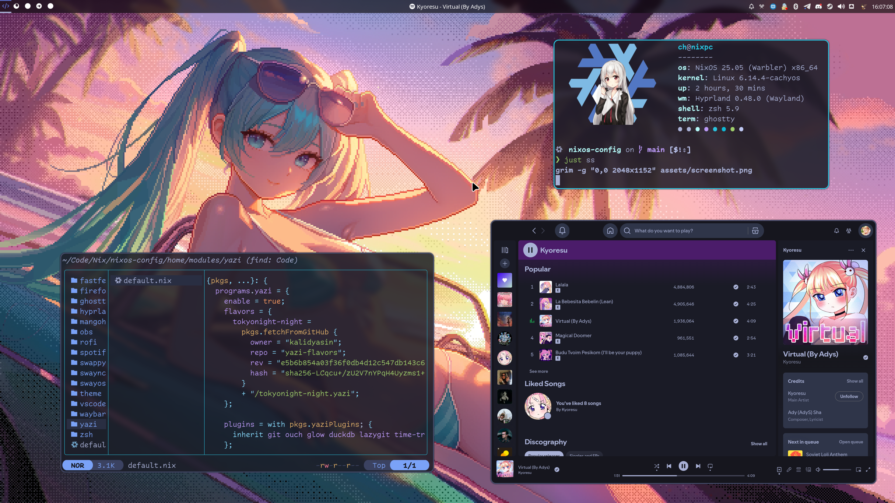

# NixOS Configuration

### I'm slowly migrating to GNU Guix from NixOS, so this repository won't update too often.

 

This repository contains my personal NixOS configuration with a modular
structure.

> [!WARNING]
> While this is my daily driver on my main machine, the configuration is still
> WIP.

## Acknowledgments

This configuration was inspired by:

- [Gylvaris/nix-config](https://github.com/Gylvaris/nix-config) (Never would try
  NixOS without him!)
- [s0me1newithhand7s/myNixConf](https://github.com/s0me1newithhand7s/myNixConf)
- [krypt0nn/dotfiles](https://github.com/krypt0nn/dotfiles)
- [TheMaxMur/NixOS-Configuration](https://github.com/TheMaxMur/NixOS-Configuration)
- [s0me1newithhand7s/reNixOS](https://github.com/s0me1newithhand7s/reNixos)
- [romek-codes/nix-config](https://github.com/romek-codes/nix-config)
- [Sk7Str1p3/dotFiles](https://github.com/Sk7Str1p3/dotFiles)
- [Frost-Phoenix/nixos-config](https://github.com/Frost-Phoenix/nixos-config)
- [TheMaxMur/NixOS-Configuration](https://github.com/TheMaxMur/NixOS-Configuration)

Big thanks to all of these amazing people!
